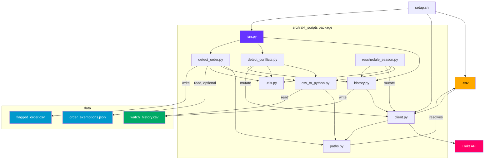

## 1. What this is and why

Trakt.tv logs every episode and movie you watch, storing each as a `watched_at` timestamp (the moment you finished). Over years of manual logging, app syncs, and bulk imports, that history picks up three kinds of mess:

| Problem | What it looks like |
| --- | --- |
| **Overlapping watches** | Two entries whose time windows overlap — e.g. a movie and an episode that both "finished" within the same hour. You can't watch two things at once. |
| **Out-of-order episodes** | S1E8 logged as watched *before* S1E7, on a first watch. |
| **Timestamp drift** | A bulk import stamped many entries with the same time, or a sync copied timestamps from the wrong time zone. |

These tools find and fix that mess.

### Offline-first

The key design choice: **analysis never touches the API.** You fetch your history once into `data/watch_history.csv`, and every analysis runs against that local file. The API is only called to download history and to apply a fix you've explicitly approved.

Why this way:

- **Fast.** Re-run a check as many times as you like — it's just reading a file, no rate limits.
- **Reproducible.** The same CSV always gives the same result.
- **Inspectable.** You can open the CSV in a spreadsheet and eyeball it before changing anything.

The tradeoff is that the snapshot goes stale — you refresh it manually after new watches or after applying a fix. For a personal project that's fine.

---

## 2. File structure

Everything lives in the `src/trakt_scripts/` package and runs as `python -m trakt_scripts.<name>`.

| File | What it does |
| --- | --- |
| `setup.sh` | First-time setup: installs the package, creates `.env`, runs device login, then starts the app. Needs an active virtualenv. |
| `.env` / `.env.example` | Your Trakt API credentials and access token. |
| `pyproject.toml` | Packaging metadata and dependencies. |
| `uv.lock` | Pinned dependency versions (committed for reproducible installs). |
| `src/trakt_scripts/paths.py` | Finds the repo root and defines where `data/` and `.env` live. |
| `src/trakt_scripts/client.py` | Everything that talks to the Trakt API: auth, requests, rate-limit handling, device login. |
| `src/trakt_scripts/history.py` | Downloads your full watch history and writes it to `data/watch_history.csv`. |
| `src/trakt_scripts/csv_to_python.py` | Loads that CSV into typed Python dicts for the analysis tools. |
| `src/trakt_scripts/utils.py` | Small shared helpers: watch durations, display titles, safe input, fuzzy show-name matching. |
| `src/trakt_scripts/run.py` | Main entry point: fetches history, then shows the menu. |
| `src/trakt_scripts/detect_conflicts.py` | Finds — and optionally fixes — watches that overlap in time. |
| `src/trakt_scripts/detect_order.py` | Finds episodes watched out of order; writes `data/flagged_order.csv`. |
| `src/trakt_scripts/reschedule_season.py` | Spreads a season's episodes across a date range you pick. |
| `data/watch_history.csv` | Your downloaded history (rewritten on every fetch). |
| `data/flagged_order.csv` | Out-of-order episodes, for review. |
| `data/order_exemptions.json` / `.json.example` | Shows/seasons to skip in the order check
| `data/.gitkeep` | Keeps the empty `data/` folder in git. |
| `README.md` | Quick-start guide. |

This design document lives in the second-brain vault, not in the repo.

---

## 3. How it fits together

`run.py` fetches history (via `history.py` → `client.py` → Trakt), which writes the CSV. The analysis tools read the CSV through `csv_to_python.py` and only call back to the API when you approve a fix. `paths.py` tells everyone where `data/` and `.env` are.



---

## 4. Reusable pieces

If you want to write a quick one-off script, these are the shared functions worth knowing. Import them from `trakt_scripts.<module>`.

**`client.py` — talking to Trakt**
- `trakt_get(path, ...)` / `trakt_post(path, body)` — HTTP calls with auth headers and rate-limit handling built in. POST/PUT/DELETE automatically wait 1 second afterwards.
- `to_trakt_iso(dt)` — formats a `datetime` into Trakt's timestamp format (`...T...000Z`, always UTC).
- `device_login()` — the OAuth device flow; writes the token into `.env`.
- `TraktRateLimitError` — raised on HTTP 429 so you can show a friendly message. (401 exits with a re-login hint.)

**`csv_to_python.py` — loading history**
- `load_rows()` — reads `data/watch_history.csv` into a list of dicts. Each row is type-cast (ints, `None`) and gets an extra `watched_dt` field: a UTC-aware `datetime` you can do math with.

**`utils.py` — per-row helpers**
- `row_duration(row)` — the watch length as a `timedelta` (uses `runtime`, or falls back to 1h for episodes / 3h for movies).
- `row_interval(row)` — `(start, end)` where `end` is `watched_dt` and `start` is `end - duration`.
- `row_title(row)` — a display string like `Show Name S01E01`, or the movie title.
- `safe_input(prompt)` — like `input()` but exits cleanly on Ctrl-C / Ctrl-D.
- `normalize_show_name(name)` / `build_show_name_map(rows)` / `find_show_matches(query, show_map)` — fuzzy show-name lookup (exact → substring → `difflib` close-match). Originally lived in `reschedule_season.py`; moved here once `detect_order.py` needed the same matching for exemptions, so both scripts share one implementation instead of two.

**`paths.py` — where things live**
- `DEFAULT_CSV`, `DATA_DIR`, `ENV_PATH`, `REPO_ROOT` — all anchored to the repo root, so scripts work from any directory.

**Example — load history and total up movie watch time:**
```python
from datetime import timedelta
from trakt_scripts.csv_to_python import load_rows
from trakt_scripts.utils import row_duration

rows = load_rows()
movies = [r for r in rows if r["type"] == "movie"]
total = sum((row_duration(r) for r in movies), timedelta())
print(f"~{total.total_seconds() / 3600:.1f} hours of movies")
```

**Example — move one history entry to a new time:**
```python
from datetime import datetime, timezone
from trakt_scripts.client import to_trakt_iso, trakt_post

trakt_post("/sync/history/remove", {"ids": [HISTORY_ID]})
trakt_post("/sync/history", {
    "shows": [{
        "ids": {"trakt": SHOW_TRAKT_ID},
        "seasons": [{"number": 2, "episodes": [
            {"number": 5, "watched_at": to_trakt_iso(datetime(2024, 3, 15, 21, tzinfo=timezone.utc))}
        ]}],
    }]
})
```

---

## 5. How the three fixes work

### 5.1 Conflicts — overlapping watches

Turn each entry into a time window: `end = watched_dt`, `start = end - duration`. Sort the windows by start time, then walk the list: two entries **overlap** if the next one starts before the current one ends. Because the list is sorted, you can stop scanning as soon as you hit an entry that starts after the current one ends.

To fix an overlap, the later entry is pushed forward so it starts exactly when the earlier one finishes — now they're back-to-back, not overlapping. After each fix the whole list is re-checked and re-sorted, and the loop repeats until nothing overlaps. Re-checking every time avoids a nasty cascade where fixing one overlap silently creates another. Each fix only moves entries *forward*, so it always finishes.

**Watch out for:** entries with no `runtime` use the 1h/3h fallback, which can flag a false overlap — review before fixing. Applying a fix changes an entry's `history_id` on Trakt, so the tool re-fetches the history afterwards to get fresh IDs.

### 5.2 Order — out-of-order episodes

The goal is to catch a *first watch* logged out of order (S1E8 before S1E7), while ignoring rewatches (watching S1E8 again later is fine).

1. Group entries by show.
2. For each `(season, episode)`, keep only the **earliest** watch — that's the first watch; drop the rest.
3. Walk those first-watches in time order, tracking the highest `(season, episode)` seen so far. Any episode that lands *below* that high-water mark was watched out of order.

Comparing `(season, episode)` as a tuple handles both within-season (`(1,8)` vs `(1,5)`) and cross-season (`(2,1)` vs `(1,12)`) cases for free. When something is flagged, the high-water mark stays put — otherwise a single regression would wrongly un-flag everything after it.

**Watch out for:** episodes you watched outside Trakt simply aren't seen. This tool only reports — it never changes Trakt. It writes the flagged episodes to `data/flagged_order.csv` and prints a `reschedule_season` command to fix them.

**Exemptions (skipping known non-linear shows/seasons):**  `detect_order.py` reads `data/order_exemptions.json` (if present) before running the check above and drops matching rows from the episode list entirely — an exempted show/season is filtered out *before* step 2, not just hidden from the output.

### 5.3 Reschedule — spread a season across a date range

Split the date range into one equal slot per episode (in episode order), give each episode a random time inside its slot, preview the old→new mapping, and — once you confirm — apply it in two API calls (bulk remove, then bulk re-add). Random times within each slot look like natural viewing instead of suspiciously evenly-spaced timestamps. It re-fetches history afterwards.

---

## 6. Data files

### `data/watch_history.csv`

Written by `history.py`, read by everything else. Fully overwritten on each fetch.

| Column | Type | Notes |
| --- | --- | --- |
| `type` | `str` | `"episode"` or `"movie"` |
| `history_id` | `int` | Trakt's ID for this watch entry; used for deletes |
| `watched_at` | `str` | ISO 8601 UTC, kept as-is |
| `show_id` | `int` or `""` | Empty for movies |
| `show_name` | `str` or `""` | Empty for movies |
| `season_number` | `int` or `""` | Empty for movies |
| `episode_number` | `int` or `""` | Empty for movies |
| `movie_title` | `str` or `""` | Empty for episodes |
| `runtime` | `int` or `None` | Minutes; `None` if Trakt has no data |
| `item_trakt_id` | `int` | Trakt ID of the show/movie itself (not the watch entry) |

`load_rows()` adds a `watched_dt` field: the `watched_at` string parsed into a UTC-aware `datetime`.

### `data/flagged_order.csv`

Written by `detect_order.py`, overwritten each run.

| Column | Notes |
| --- | --- |
| `history_id` | The out-of-order episode's watch entry |
| `show_name`, `season_number`, `episode_number` | Which episode it is |
| `watched_at` | When it was logged |
| `expected_after_title` | The episode that should have come first |
| `expected_after_watched_at` | When that episode was logged |

### `data/order_exemptions.json`

Hand-edited, read (never written) by `detect_order.py`. A JSON array; missing file means no exemptions. Gitignored since it's personal preference, not shared config — `data/order_exemptions.json.example` is the committed starting point.

```json
[
  { "show": "Black Mirror" },
  { "show": "Fleabag", "season": 2 }
]
```

### `data/.gitkeep`

Empty file that keeps the `data/` folder in git (git doesn't track empty directories). The `.gitignore` excludes the CSVs themselves (personal data) but keeps this sentinel.

---

## 7. How to use

```bash
# Main workflow: fetch history, then pick a check
python -m trakt_scripts.run
python -m trakt_scripts.run --no-fetch      # skip fetch, reuse existing CSV

# Standalone steps
python -m trakt_scripts.history             # fetch snapshot only
python -m trakt_scripts.detect_conflicts    # overlap check + optional fix
python -m trakt_scripts.detect_order        # order check → flagged_order.csv
python -m trakt_scripts.reschedule_season \
  --show-name "Breaking Bad" --season 2 \
  --start 2023-06-01 --end 2023-07-31

# Re-authenticate when the token expires
python -m trakt_scripts.client
```

`reschedule_season` flags:

| Flag | Required | Description |
| --- | --- | --- |
| `--show-name NAME` | Yes | Show name (matched against the CSV) |
| `--season N` | Yes | Season number |
| `--start YYYY-MM-DD` | Yes | Start of the date range (UTC start of day) |
| `--end YYYY-MM-DD` | Yes | End of the date range (UTC end of day) |
| `--csv PATH` | No | Alternate CSV path (default: `data/watch_history.csv`) |
